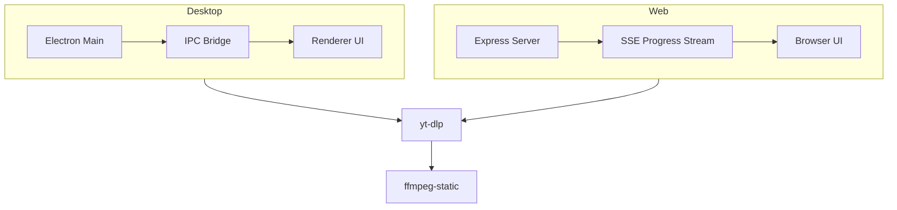

# RoiTube (`ydl`)

Cross-platform video and audio downloader for YouTube, TikTok, Instagram, Twitter/X, and 1,800+ sites. Ships as a **portable Electron desktop app** and a **Node.js web server** with real-time progress streaming.

[](https://www.electronjs.org/)
[](https://nodejs.org/)
[](https://github.com/yt-dlp/yt-dlp)
[](https://opensource.org/licenses/MIT)

---

## System Design



| Variant | Engine | Progress | Challenge bypass |
|---------|--------|----------|------------------|
| **Desktop** | Electron + bundled `node` in userData | IPC events | Native JS environment for signature deciphering |
| **Web** | Express + SSE | Server-sent events | Optional `cookies.txt` upload for datacenter IPs |

---

## Premium Features

*   **⚡ Real-Time Speed Graph & Disk Monitor**: A custom HTML5 canvas dashboard widget showing real-time network download speeds and host disk space availability.
*   **🎨 Harmonious Theme Customizer**: Supports three curated, sleek themes with smooth transition animations and state persistence (`localStorage`):
    1.  *Vibrant Neon*: A beautiful high-contrast dark cyberpunk theme.
    2.  *Glassmorphism*: Sleek semi-translucent cards over dual-radial colored glowing backdrops.
    3.  *Clean Minimal*: A modern, flat light theme.
*   **🎬 In-Browser Media Preview Player**: Stream and preview completed downloads directly inside the browser or desktop app (using a secure, custom `media://` streaming protocol) before saving to disk.
*   **📋 Auto-Detect Clipboard Link**: A helper button that detects URLs on your clipboard and lets you paste and validate links with a single click.
*   **✂️ Video Trimming & Subtitles**: Cut specific sections of a video before downloading (using `--download-sections` and keyframe cuts) and embed subtitle tracks dynamically.
*   **🔐 Bulletproof Challenge Bypass**:
    *   *Desktop App*: Natively bundles a JS environment (by duplicating the Electron executable as `node` in `userData`) so `yt-dlp` can solve signature deciphering challenges out of the box on all end-user PCs.
    *   *Web App*: Supports importing Netscape `cookies.txt` files directly in the Settings tab to bypass data center IP bans on cloud platforms like Render or Railway.

---

## 🛠️ Technology Stack

*   **Core**: HTML5, Vanilla CSS3 (Custom Variables & Gradients), Modern ES6+ JavaScript.
*   **Desktop Engine**: Electron with a secure `preload` bridge and IPC communication.
*   **Web Engine**: Node.js, Express, and SSE (Server-Sent Events) for real-time progress push.
*   **Processors**: `yt-dlp` (auto-updated engine) and `ffmpeg-static` for format merging/transcoding.

---

## 🚀 Getting Started

### Prerequisites
*   [Node.js](https://nodejs.org/) (v18.0.0 or higher)
*   [Git](https://git-scm.com/)

---

### Option A: Desktop App (Electron)

#### 1. Setup & Launch in Development
```bash
# Clone the repository
git clone https://github.com/iamroidev/ydl.git
cd ydl

# Install dependencies
npm install

# Run the app in development mode
npm run dev
```

#### 2. Package as a Portable Windows Executable
To package the app into a single, self-contained, portable `.exe` file that works on any client computer:
```bash
npm run build:portable
```
The output executable will be created inside the `dist/` directory as `RoiTube.exe`.

---

### Option B: Web Version (Node.js Server)

#### 1. Setup & Launch Locally
```bash
# Navigate to the web folder and install dependencies
cd web
npm install

# Run the web server
node server.js
```
The application will be accessible locally at `http://localhost:3000`.

#### 2. Cloud Deployment (Render / Railway)
1.  Push the repository to GitHub.
2.  Deploy a new **Web Service** on Render or Railway, pointing to the repository.
3.  Set the **Build Command** to `cd web && npm install` and the **Start Command** to `cd web && node server.js`.
4.  *Note:* To prevent YouTube from blocking your datacenter IP, log in to the web app, go to the **Settings** tab, and upload a `cookies.txt` exported from your browser.

---

## 📁 Repository Structure

```
├── build/                # Build assets and app icons
├── dist/                 # Packaged desktop executables
├── scripts/              # Icon generation and utility scripts
├── src/
│   ├── main/             # Electron main process (IPC handlers & protocols)
│   └── renderer/         # Electron frontend UI & styles
└── web/
    ├── public/           # Web app frontend assets (HTML, CSS, JS)
    └── server.js         # Express web server backend
```

---

## 🤝 Contributing

Contributions, bug reports, and feature requests are welcome! Feel free to open issues or submit pull requests.

## 📄 License

This project is licensed under the MIT License - see the [LICENSE](LICENSE) file for details.

**Author:** [iamroidev](https://github.com/iamroidev)
